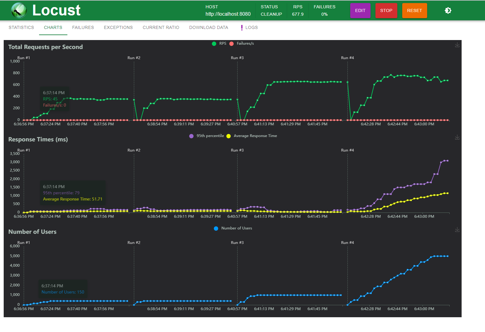
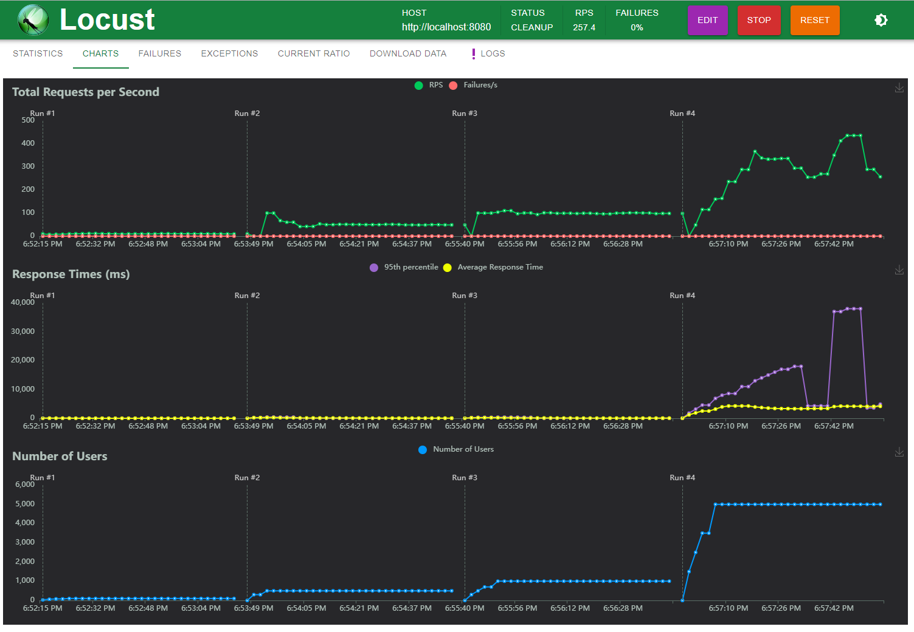

# Tuum test assigntment

## Prerequisites

- Java JDK 11 or later
- Gradle 
- Docker and Docker Compose

## Getting Started

These instructions will get your copy of the project up and running on your local machine for development and testing purposes.

### Using Docker and Docker Compose

This project includes a `docker-compose.yml` file for running the application along with its dependencies.

#### Starting the Application with Docker Compose

To start the application along with its dependencies (e.g., PostgreSQL database, RabbitMQ):

```sh
docker-compose up
```
This command will start all the services defined in `docker-compose.yml`.

#### Stopping the Application

To stop the application and remove the containers, use:

```sh
docker-compose down
```

All variables, ports and etc are hardcoded and can be found in docker-compose.yml.

### Building the Application

To build the application, run the following command in the root directory of your project:

```sh
./gradlew build
```

## Application Configuration

Explain any steps needed to configure the application (e.g., environment variables, configuration files).

## Testing

Describe how to run the automated tests for this system. For example:

```sh
./gradlew test
```

## Built With

- [Spring Boot](https://spring.io/projects/spring-boot) - The web framework used
- [Gradle](https://gradle.org/) - Dependency Management
- [Docker](https://www.docker.com/) - Containerization platform
- [RabbitMQ](https://www.rabbitmq.com/) - Messaging broker

## Explanation of important choices in my solution
In writing the code, I tried to follow the principle of good coding practices, keeping the code readable and understandable. According to the work instructions, a message is sent to RabbitMQ only when a new user is created. Update operations are not sent because, according to the work instructions, the account service does not perform any such operations. Therefore, only one queue was created in RabbitMQ. In the case of MyBatis, I used annotations and did not configure anything in XML files. I made this decision purely out of interest to understand how capable MyBatis is when using annotations, but over time I realized that annotations do not seem to be as flexible as defining in an XML file. The database is designed so that there is no separate customer table, and the customer_id in the accounts table is not unique. I made this decision because the server's focus was directed elsewhere, and it was not defined what exactly is meant by a user. A quick solution would have been an additional table and a 1:n relationship between the user and accounts.

## Considerations of Horizontal Scaling
1. I would implement a robust load balancer solution to distribute incoming traffic evenly across multiple instances or servers. This could be achieved using technologies like Nginx or HAProxy.
2. Utilizing cloud computing technologies allows for configurations based on demand. During peak times, resources can be dynamically allocated to provide additional computational power, ensuring scalability and performance as needed. Cloud platforms often offer managed services for auto-scaling, load balancing, and other essential functions.
3. I could horizontally scale databases across many instances. One approach is to distribute the database across multiple instances or nodes to spread the data. Each instance holds a portion of the data, and queries are routed to the appropriate instances based on the data partitioning scheme. Other methods include data partitioning, load balancing, sharding, etc.
4. RabbitMQ can be a useful component for message queuing and asynchronous communication, aiding in decoupling components and managing high volumes of messages in distributed systems.

## Transactions per second
I decided to test it on my own. For that I used Locust, which is open-source load testing framework. I tested two API-s

GET transactions: During the testing, it was observed that the maximum number of transactions per second reached around 700. However, upon surpassing this threshold, Locust indicated that the CPU usage was excessively high. Below is a chart illustrating the performance:


POST transaction: For the API endpoint responsible for adding transactions, the maximum number of transactions per second exceeded 300.

